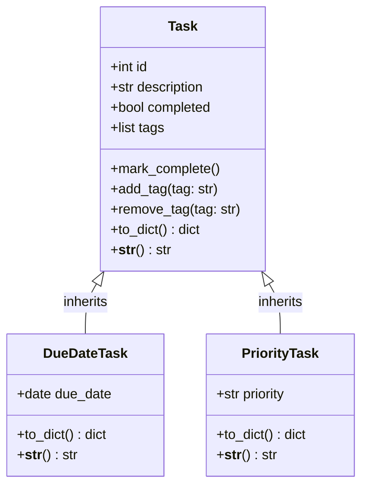
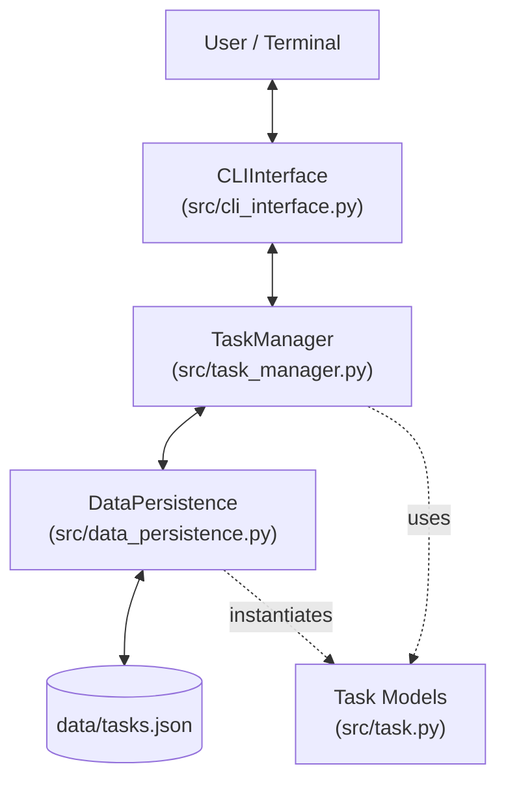

# 📐 Project Plan & Architecture: Enhanced Task Manager CLI (Final Version)

## 1. บทนำและวัตถุประสงค์ (Introduction & Objectives)
เอกสารฉบับนี้เป็นพิมพ์เขียว (Blueprint) และบันทึกการสะท้อนผลการพัฒนา (Reflection Document) สำหรับโครงงาน **Enhanced Task Manager CLI Application** ซึ่งเป็นโครงงานปลายภาคประจำสัปดาห์ที่ 12 ของวิชาการเขียนโปรแกรมเชิงวัตถุ (OOP)

โครงงานนี้มีเป้าหมายเพื่อพัฒนาแอปพลิเคชันบริหารจัดการงานผ่านหน้าจอคำสั่ง (Command-Line Interface) ที่มีความสมบูรณ์ รองรับการขยายตัว (Extensibility) มีสถาปัตยกรรมแบบแยกส่วน (Modular Architecture) และมีกลไกการสืบทอดคุณสมบัติ (Inheritance) รวมถึงความหลากหลายของพฤติกรรม (Polymorphism)

---

## 2. ข้อกำหนดของระบบ (Requirements Specification)

### 2.1 ข้อกำหนดเชิงฟังก์ชัน (Functional Requirements)
1. **การจัดการงานพื้นฐาน (CRUD Operations)**:
   - สามารถสร้างงานได้ 3 รูปแบบ: งานทั่วไป (`Task`), งานที่มีวันกำหนดส่ง (`DueDateTask`), งานที่มีระดับความสำคัญ (`PriorityTask`)
   - รองรับการติดป้ายกำกับ (Tags) ได้หลายป้ายต่องานหนึ่งชิ้น
   - สามารถแสดงรายการงานทั้งหมดพร้อมรายละเอียดที่ครบถ้วน
   - สามารถเปลี่ยนสถานะงานเป็น "เสร็จสิ้น" (Completed) ผ่าน ID
   - สามารถลบงานออกจากระบบผ่าน ID
2. **การค้นหาและเข้าถึงข้อมูลขั้นสูง (Advanced Retrieval)**:
   - **Search**: ค้นหาข้อความแบบไม่สนตัวพิมพ์เล็ก-ใหญ่ (Case-insensitive) จากทั้ง `description` และ `tags`
   - **Filter**: กรองงานแบบระบุเงื่อนไขพร้อมกันหลายมิติ:
     - กรองตามสถานะ (Completed / Pending)
     - กรองตามช่วงเวลาส่ง (Due Date ก่อนหรือหลังวันที่ระบุ)
     - กรองตามระดับความสำคัญ (High / Medium / Low)
     - กรองตามชุดของ Tags (งานต้องมีแท็กครบทุกตัวที่กำหนด)
   - **Sort**: เรียงลำดับงานตามเกณฑ์ต่างๆ ได้ทั้งจากน้อยไปมาก (Ascending) และมากไปน้อย (Descending):
     - เรียงตาม ID (ค่าตั้งต้น)
     - เรียงตาม Description (ก-ฮ, A-Z)
     - เรียงตามสถานะการเสร็จสิ้น (Pending ขึ้นก่อน)
     - เรียงตามวันกำหนดส่ง (DueDateTask เรียงตามลำดับเวลา, งานประเภทอื่นถูกจัดกลุ่มไว้ท้ายสุด)
     - เรียงตามระดับความสำคัญ (High -> Medium -> Low, งานที่ไม่มีความสำคัญถูกจัดกลุ่มไว้ท้ายสุด)
3. **การจัดเก็บข้อมูลถาวร (Data Persistence)**:
   - บันทึกและโหลดข้อมูลงานทั้งหมดในรูปแบบไฟล์ JSON (`data/tasks.json`) อัตโนมัติ
   - สามารถแปลงโครงสร้าง JSON กลับมาเป็น Instance ของ Class เดิมได้อย่างแม่นยำ (Object Deserialization)
   - รองรับ Schema Backward Compatibility ในกรณีที่อ่านไฟล์ข้อมูลรุ่นเก่าที่ไม่มีฟิลด์ `tags`

### 2.2 ข้อกำหนดที่ไม่ใช่เชิงฟังก์ชัน (Non-Functional Requirements)
* **Usability**: ส่วนต่อประสานแบบ CLI มีเมนูที่ชัดเจน ข้อความตอบรับที่เข้าใจง่าย และมีการจัดรูปแบบตาราง/รายการที่อ่านสะดวก
* **Reliability & Robustness**: มีการตรวจสอบความถูกต้องของข้อมูลนำเข้า (Input Validation) เช่น รูปแบบวันที่ `YYYY-MM-DD`, ค่าความสำคัญที่ถูกต้อง, และการกรองข้อมูลที่ไม่ทำให้โปรแกรม Crash
* **Maintainability**: แยกโค้ดออกเป็นโมดูลย่อยตามหน้าที่อย่างชัดเจน (Separation of Concerns) โค้ดอ่านง่าย ตรงตามมาตรฐาน PEP 8
* **Testability**: มีชุดทดสอบอัตโนมัติ (Automated Unit Tests) ที่ครอบคลุมทุกโมดูล สามารถรันตรวจสอบความถูกต้องได้ทุกเมื่อ

---

## 3. สถาปัตยกรรมระบบและการออกแบบคลาส (System Architecture & Design)

### 3.1 Class Hierarchy Diagram
ระบบใช้หลักการสืบทอดคุณสมบัติ (Class Inheritance) โดยมี `Task` เป็นคลาสแม่ และมี Subclasses ขยายความสามารถ:



### 3.2 Modular Component Diagram
แอปพลิเคชันแบ่งออกเป็น 4 ชั้น (Layers) เพื่อให้แต่ละโมดูลมีหน้าที่รับผิดชอบเพียงอย่างเดียว:



---

## 4. รายละเอียดการพัฒนาและความท้าทายทางเทคนิค (Technical Challenges & Solutions)

### 4.1 ระบบ Tags (Categorization)
* **โจทย์**: งานหนึ่งชิ้นสามารถมีป้ายกำกับได้มากกว่า 1 ป้าย และต้องป้องกันการใส่แท็กซ้ำหรือมีช่องว่างส่วนเกิน
* **ทางแก้**: 
  - ใช้วิธี Normalization ใน `add_tag()` โดยตัดช่องว่างด้วย `.strip()` และแปลงเป็นพิมพ์เล็กด้วย `.lower()`
  - ตรวจสอบ `if tag not in self.tags:` ก่อนทำการ append
  - ใน `data_persistence.py` ใช้ `t_dict.setdefault('tags', [])` เพื่อให้โค้ดสามารถเปิดไฟล์ JSON เดิมของระบบได้โดยไม่เกิด `KeyError`

### 4.2 ระบบค้นหา (Search Logic)
* **โจทย์**: ค้นหาคำค้นหาที่อาจอยู่บางส่วนของรายละเอียด หรืออาจอยู่ในรายชื่อแท็ก
* **ทางแก้**:
  - แปลง Keyword เป็นตัวพิมพ์เล็ก
  - ใช้ `keyword_lower in task.description.lower()` สำหรับรายละเอียด
  - ใช้ `any(keyword_lower in tag.lower() for tag in task.tags)` สำหรับแท็ก

### 4.3 ระบบกรองแบบผสมผสาน (Multi-criteria Filtering)
* **โจทย์**: ผู้ใช้สามารถเลือกกรองเฉพาะบางเงื่อนไข หรือกรองพร้อมกันทั้งหมดได้ (เช่น กรองงานที่ "ยังไม่เสร็จ" AND "มีแท็ก study" AND "ส่งก่อนสิ้นเดือน")
* **ทางแก้**:
  - ใช้วิธี Sequential Pipeline Filtering โดยเริ่มต้นจาก `filtered_tasks = self.tasks` แล้วนำผลลัพธ์ไปกรองต่อทีละเงื่อนไข
  - ในการกรองตามวันส่ง ต้องใช้ `isinstance(t, DueDateTask)` เพื่อป้องกัน `AttributeError` เนื่องจาก `Task` ทั่วไปไม่มีแอตทริบิวต์ `due_date`
  - ในการกรองตามชุด Tags ใช้ `all(ctag in [t_tag.lower() for t_tag in t.tags] for ctag in contains_tags_lower)` เพื่อยืนยันว่างานชิ้นนั้นมีแท็กครบทุกตัวที่ระบุ

### 4.4 การจัดเรียงเชิงพหุสัณฐาน (Polymorphic Sorting)
* **โจทย์**: ในลิสต์มีอ็อบเจกต์หลายประเภทปะปนกัน (`Task`, `DueDateTask`, `PriorityTask`) เมื่อสั่งเรียงตามวันส่ง หรืองานด่วน งานที่ไม่มีคุณสมบัตินั้นจะเรียงอย่างไรไม่ให้โปรแกรม Error
* **ทางแก้**:
  - **สำหรับ Due Date**: กำหนด Key ให้เป็น Tuple `(t.due_date if isinstance(t, DueDateTask) else datetime.date.max, t.id)` ส่งผลให้อ็อบเจกต์ที่ไม่มีวันส่งได้ค่าวันที่มากที่สุดในระบบ (`date.max`) จึงถูกผลักไปอยู่ท้ายตารางเสมอ
  - **สำหรับ Priority**: สร้าง Priority Dictionary Mapping:
    ```python
    PRIORITY_MAP = {"High": 1, "Medium": 2, "Low": 3}
    ```
    และกำหนด Key เป็น `(self.PRIORITY_MAP.get(t.priority, 99) if isinstance(t, PriorityTask) else 99, t.id)` งานที่ไม่มี Priority จะได้ค่า 99 และถูกผลักไปอยู่ท้ายตารางเช่นกัน
  - กำหนด `t.id` เป็น Secondary Key ใน Tuple เสมอ เพื่อให้ลำดับคงที่และคาดเดาได้ (Deterministic Ordering)

---

## 5. บทเรียนที่ได้รับและการสะท้อนผล (Lessons Learned)

1. **ประโยชน์ของการเขียนแบบแยกโมดูล (Modularity)**: เมื่อเกิดข้อผิดพลาด สามารถตีกรอบปัญหาได้ทันที เช่น หากวันที่มีรูปแบบผิด เกิดขึ้นที่ขั้นตอนรับค่าใน `cli_interface.py` แต่หากคำนวณการกรองผิดพลาด เกิดขึ้นที่ `task_manager.py`
2. **ความสำคัญของ Unit Testing**: การมีไฟล์ทดสอบ `tests/test_task_manager.py` ช่วยให้สามารถปรับปรุง Refactor โค้ดได้อย่างมั่นใจ และตรวจพบปัญหาการ Import ข้ามโมดูลได้อย่างรวดเร็ว
3. **การออกแบบเพื่อรองรับการเปลี่ยนแปลงในอนาคต (Backward Compatibility)**: ข้อมูลในไฟล์บันทึกต้องมีความยืดหยุ่น การใช้ฟิลด์ระบุประเภท `_type` ร่วมกับ `setdefault()` ช่วยให้ระบบสามารถอ่านข้อมูลเวอร์ชันก่อนหน้าได้โดยราบรื่น

---

## 6. แผนการพัฒนาต่อยอดในอนาคต (Future Extensions)

* **Graphical User Interface (GUI)**: พัฒนาส่วนต่อประสานแบบกราฟิกด้วย `PyQt6` หรือ `Tkinter` เพื่อให้ผู้ใช้ทั่วไปใช้งานได้สะดวกยิ่งขึ้น
* **Database Integration**: ยกระดับจากไฟล์ JSON ไปใช้ระบบฐานข้อมูลเชิงสัมพันธ์อย่าง `SQLite` หรือ `PostgreSQL` พร้อมระบบ Transaction ที่ปลอดภัย
* **Notification System**: เพิ่มระบบแจ้งเตือนงานที่ใกล้ถึงกำหนดส่งผ่าน Notification บนระบบปฏิบัติการ หรือแจ้งเตือนผ่าน LINE Notify / Discord Webhook
* **User Authentication & Multi-tenancy**: เพิ่มระบบ Login สำหรับผู้ใช้งานหลายคน เพื่อแยก Task List ของแต่ละบุคคล
* **REST API Backend**: ปรับแต่ง Business Logic เพื่อเชื่อมต่อกับ Web Framework อย่าง `FastAPI` เพื่อให้สามารถต่อยอดเป็น Web App หรือ Mobile App ได้ในอนาคต
